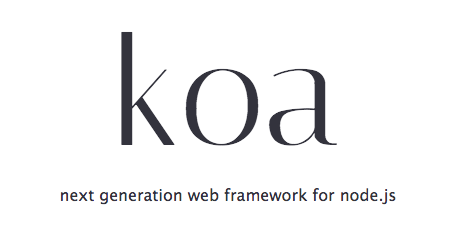

A collection of simple demos of [Koa](http://koajs.com/), a web application framework for Node.



## How to use

First of all, check your Node version.

```bash
$ node -v
v8.0.0
```

Koa requires node v7.6.0+. If your version is older than that, upgrade Node first.


```bash
$ git clone git@github.com:ruanyf/koa-demos.git
```

Install the dependencies.

```bash
$ cd QCKoaDemos
$ npm install
```

Now play with the [source files](https://github.com/canwhite/QCKoaDemos) under the demos directory.

